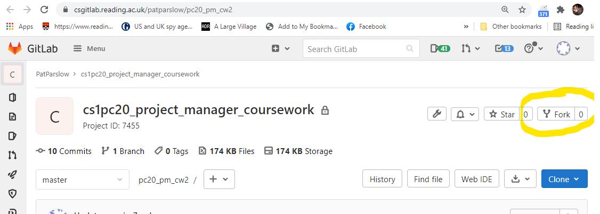
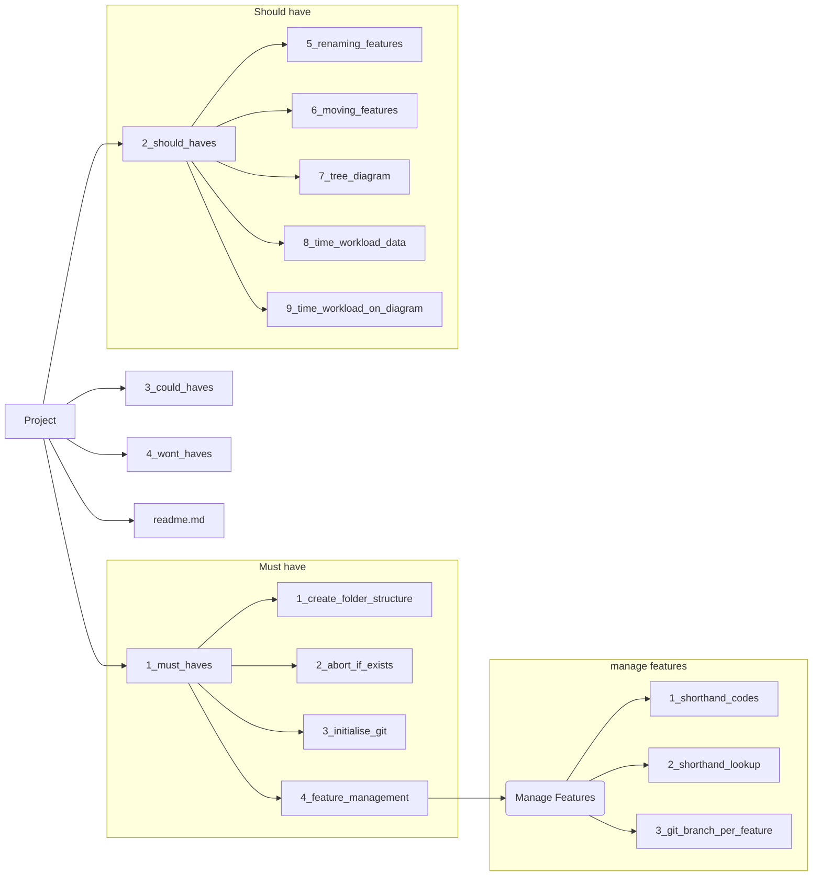

# Coursework 2 Project Planning exercise

Planning is the keystone of successful programming, but it need not all be dry paperwork.  The idea of experimenting with code in a series of feasibility studies can really help identify which approach to take.

In this exercise, you have some thinking to do, and you should get together with others in your peer group (other students) to discuss ideas.

First, though, grab a copy of this project by going to it on CSGitLab and using the "Fork" button near the top right corner.

Please set your version of the project to "private" after forking.

## Goals 

Identify the key goals you need to complete for the coursework

1.
1.
1.
1.
1.

## Requirements to fulfill goals

What do you need to be able to meet those goals?  This can include clearer specifications, tests (what needs testing, how to test it?), knowledge etc.

1.
1.
1.
1.
1.

## Dependencies (mapping goals/requirements etc)

Which requirements relate to which goals - think about drawing out a Product Breakdown for the coursework

1.
1.
1.
1.
1.

_**Hint**_: This might look something like this:

## Plan:

### What experimental code can I write now? (feasibility studies)

1. 
1.
1.
1.
1.

_**Hint**_: try modifying the make file created in week4, consider the code in the videos for ideas about automating your code build, and the video on restucturing your project folder, for instance.

### What were the results of trying things out?

1.
1.
1.
1.
1.
